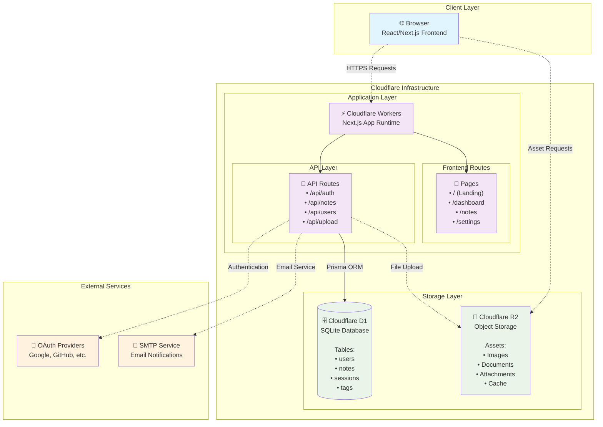

# Note-Taking Web App

A full-stack note-taking web application with user authentication, CRUD operations, search functionality, and theming capabilities. Built with Next.js 15, React 19, Tailwind CSS v4, Cloudflare D1 (SQLite), and Drizzle ORM. Deployed on Cloudflare Workers with R2 storage.

## 📋 Table of Contents

- [Features](#features)
- [Tech Stack](#tech-stack)
- [Project Structure](#project-structure)
- [Development Tasks](#development-tasks)
- [Getting Started](#getting-started)
- [Documentation](#documentation)
- [Contributing](#contributing)

## ✨ Features

### Core Functionality

- **Note Management**: Create, read, update, and delete notes with rich text content
- **Organization**: Tag-based organization and archive functionality
- **Search**: Advanced search across title, content, and tags with highlighting
- **Auto-save**: Debounced auto-save to prevent data loss

### Authentication & Security

- **Protected Routes**: Authorization with Next-Auth, which is a Cookie-based authentication system
- **Dual Authentication( Planned 📝)**: Email/password and Google OAuth 2.0 login
- **Password Recovery(Planned 📝)**: Email-based password reset for traditional accounts

### User Experience

- **Edit History**: Full undo/redo functionality with version control
- **Themes**: Light/dark mode with font customization
- **Accessibility**: Full keyboard navigation support (Ctrl+Z, Ctrl+Y, etc.)
- **Responsive Design**: Optimized for desktop, tablet, and mobile devices

### Advanced Features (Planned)

- **Real-time Collaboration**: WebSocket-based collaborative editing
- **Image Support**: S3-compatible image upload and storage
- **Version History**: Restore notes to previous versions

## 🛠 Tech Stack



### Frontend

- **Next.js 15.5.2** with App Router
- **React 19.1.0** with React DOM 19.1.0
- **TypeScript 5** for type safety
- **Tailwind CSS v4** for styling with PostCSS
- **TanStack React Query 5.90.1** for state management and caching
- **Zod 4.1.8** for data validation
- **Editor.js 2.31.0** for rich text editing with plugins:
  - Header, Paragraph, List, Quote, Delimiter plugins
- **Radix UI** components for accessible UI primitives
- **Next Themes 0.4.6** for theme management
- **Lucide React** for icons
- **Sonner** for toast notifications

### Backend & API

- **Next.js API Routes** for serverless functions
- **Drizzle ORM 0.44.5** with Drizzle Kit 0.31.4
- **Cloudflare D1** (SQLite) as primary database
- **NextAuth.js 4.24.11** for authentication
- **JWT** for session management with bcryptjs for password hashing
- **@opennextjs/cloudflare 1.8.0** for Cloudflare Workers deployment
- **next-openapi-gen** for API documentation

### Database & Storage

- **Cloudflare D1** (SQLite) as primary database
- **Drizzle ORM** for database management and migrations
- **Cloudflare R2(Planned 📝)** for object storage (images, files)
- **Better SQLite3** for local development

### DevOps & Testing

- **OpenNext.js Cloudflare** for Cloudflare Workers deployment
- **Wrangler 4.34.0** for Cloudflare development and deployment
- **GitHub Actions** for CI/CD
- **Vitest 3.2.4** with coverage and UI for testing
- **Testing Library** (React, Jest DOM, User Event) for component testing
- **ESLint 9** with Next.js config for code quality
- **TypeScript** strict mode for type checking

## 📁 Project Structure

```
note-taking-web-app/
├── .wrangler/                # Cloudflare local cache (D1, R2, etc.)
├── .open-next/               # OpenNext.js build output for Cloudflare Workers
├── .taskmaster/              # Task Master configuration
│   ├── docs/                 # Project documentation
│   ├── tasks/                # Individual task files
│   └── config.json           # Task Master settings
├── docs/                     # Additional documentation
│   ├── ENVIRONMENT_SETUP.md  # Development setup guide
│   ├── API_DOCUMENTATION.md  # API documentation
│   └── references/           # Reference documentation
├── migrations/               # Drizzle ORM database migrations(and SQL Schema for D1)
│   ├── meta/                 # Migration metadata
│   └── *.sql                 # SQL migration files
├── scripts/                  # Development and deployment scripts
│   ├── migrate-d1.sh         # D1 migration helper
│   ├── seed.ts               # Database seeding
│   └── test-*.ts             # Testing utilities
├── src/
│   ├── app/                  # Next.js App Router
│   │   ├── (auth)/           # Authenticated routes
│   │   ├── api/              # API routes
│   │   └── api-docs/         # API documentation
│   ├── components/           # Reusable React components
│   │   ├── auth/             # Authentication components
│   │   ├── sidebars/         # Sidebar components
│   │   └── ui/               # UI primitives
│   ├── hooks/                # Custom React hooks
│   ├── lib/                  # Utility functions and configurations
│   └── types/                # TypeScript type definitions
└── public/                   # Static assets
```

## 🚀 Getting Started

### Prerequisites

- **Node.js 20+** (specified in engines)
- **npm 9+** (specified in engines)
- **Cloudflare Account** for D1 database and R2 storage
- **Wrangler CLI** for Cloudflare development

### Development Setup

1. **Clone the repository**

   ```bash
   git clone <repository-url>
   cd note-taking-web-app
   ```

2. **Install dependencies**

   ```bash
   npm install
   ```

3. **Install and authenticate Wrangler CLI**

   ```bash
   # Install Wrangler globally (if not already installed)
   npm install -g wrangler

   # Login to Cloudflare (opens OAuth flow in browser)
   wrangler login

   # Verify authentication
   wrangler whoami
   ```

4. **Create Cloudflare resources (first-time setup)**

   ```bash
   # Create D1 database
   wrangler d1 create noteapp
   # Copy the database_id from output and update wrangler.jsonc

   # Create R2 bucket for caching (optional)
   wrangler r2 bucket create note-taking-app-cache
   ```

5. **Set up environment variables**

   ```bash
   # Copy environment template
   cp .env.example .dev.vars

   # Edit .dev.vars with your configuration
   # Required variables:
   # - JWT_SECRET (at least 32 characters)
   # - NEXTAUTH_SECRET (at least 32 characters)
   # - NEXTAUTH_URL (http://localhost:3000 for local dev)
   ```

6. **Initialize and migrate database**

   ```bash
   # Generate Drizzle schema
   npm run db:generate

   # Apply migrations to local D1 database
   npm run db:migrate

   # Optional: Seed database with sample data
   npm run db:seed
   ```

7. **Start development server**

   ```bash
   npm run dev           # Start Next.js development server
   ```

8. **Verify setup**

   ```bash
   # Check database tables
   npm run db:tables

   # Check migration status
   npm run db:status

   # Test API health endpoint
   curl http://localhost:3000/api/health
   ```

### Important Notes

**Database Configuration:**

- The `wrangler.jsonc` file contains a pre-configured `database_id`. If you're setting up a new project, you'll need to:
  1. Create your own D1 database using `wrangler d1 create noteapp`
  2. Update the `database_id` in `wrangler.jsonc` with your new database ID
  3. Update the `database_id` in the D1 bindings section

**Environment Files:**

- `.dev.vars` - Local development environment variables (not committed to git)
- `.env.example` - Template for environment variables
- Cloudflare Dashboard - Production environment variables

**First-Time Setup Checklist:**

- [ ] Wrangler CLI installed and authenticated
- [ ] D1 database created and ID updated in `wrangler.jsonc`
- [ ] `.dev.vars` file created with required secrets
- [ ] Database migrations applied (`npm run db:migrate`)
- [ ] Development server running (`npm run dev`)
- [ ] Health check passing (`curl http://localhost:3000/api/health`)

### Troubleshooting

**Issue: "Database not found" error**

```bash
# Ensure D1 database exists
wrangler d1 list

# If not exists, create it
wrangler d1 create noteapp

# Update wrangler.jsonc with the database_id from output
```

**Issue: "Unauthorized" when calling APIs**

```bash
# For NextAuth endpoints (/api/notes, /api/tags):
# 1. Sign in through the web UI at http://localhost:3000
# 2. Session cookie will be automatically set

# For JWT endpoints (/api/test-auth):
# 1. Call POST /api/login to get a token
# 2. Use Authorization: Bearer <token> header
```

**Issue: Migrations not applying**

```bash
# Reset local database
npm run db:reset

# Regenerate schema
npm run db:generate

# Apply migrations
npm run db:migrate
```

### GitHub Actions Setup (CI/CD)

To enable automated deployment, configure the following secrets in your GitHub repository:

**Required Secrets:**

1. Go to your GitHub repository → Settings → Secrets and variables → Actions
2. Add the following repository secrets:

| Secret Name             | Description                                       | How to Get                                                    |
| ----------------------- | ------------------------------------------------- | ------------------------------------------------------------- |
| `CLOUDFLARE_API_TOKEN`  | Cloudflare API token with Workers:Edit permission | Cloudflare Dashboard → My Profile → API Tokens → Create Token |
| `CLOUDFLARE_ACCOUNT_ID` | Your Cloudflare account ID                        | Cloudflare Dashboard → Right sidebar                          |
| `NEXTAUTH_SECRET`       | NextAuth secret (32+ characters)                  | Generate: `openssl rand -base64 32`                           |
| `NEXTAUTH_URL`          | Production URL                                    | Your deployed app URL (e.g., `https://your-app.pages.dev`)    |
| `GOOGLE_CLIENT_ID`      | Google OAuth client ID (optional)                 | Google Cloud Console                                          |
| `GOOGLE_CLIENT_SECRET`  | Google OAuth secret (optional)                    | Google Cloud Console                                          |

**Generate Secrets:**

```bash
# Generate NEXTAUTH_SECRET
openssl rand -base64 32

# Generate JWT_SECRET (if needed)
openssl rand -base64 32
```

**Cloudflare API Token Permissions:**

When creating the API token, ensure it has:

- Account → Workers Scripts → Edit
- Account → Workers KV Storage → Edit (if using KV)
- Account → D1 → Edit
- Account → Workers R2 Storage → Edit (if using R2)

**Deployment Workflow:**

The GitHub Actions workflow automatically:

1. Runs on push to `main` branch (after CI passes)
2. Generates Drizzle client
3. Generates OpenAPI documentation
4. Applies database migrations to production D1
5. Sets Cloudflare Worker secrets
6. Builds and deploys to Cloudflare Workers

**Manual Deployment:**

You can also trigger deployment manually:

1. Go to Actions tab in GitHub
2. Select "Deploy to Cloudflare" workflow
3. Click "Run workflow"

### Task Management

This project uses Task Master for development workflow:

```bash
# View all tasks
task-master list

# Get next recommended task
task-master next

# View specific task details
task-master show 1

# Mark task as completed
task-master set-status --id=1 --status=done
```

## 📚 Documentation

- [API Documentation](./docs/API_DOCUMENTATION.md) - **Centralized** API reference with tech stack, schemas, and endpoints
- [Environment Setup](./docs/ENVIRONMENT_SETUP.md) - Complete setup guide for local and production environments
- [Routing & State Management](./docs/ROUTING_AND_STATE_MANAGEMENT.md) - Frontend architecture and navigation
- [Third-Party Integrations](./docs/THIRD_PARTY.md) - External dependencies, Cloudflare services, and integrations

### References

1. [Task Master](https://github.com/eyaltoledano/claude-task-master) -- Task management tool for developers
2. [Drizzle ORM](https://orm.drizzle.team) -- Database schema management
3. [OpenNext.js](https://opennext.js.org) -- Next.js deployment on Cloudflare Workers
4. [Cloudflare](https://developers.cloudflare.com/workers/framework-guides/web-apps/nextjs/) -- Cloudflare services
5. [NextAuth.js](https://next-auth.js.org) -- Authentication for Next.js
6. [TanStack Query](https://tanstack.com/query/v5) -- Data fetching and state management
7. [Schadcn/UI](https://ui.shadcn.com) -- UI components

### Discussion

1. [swagger-ui-react - update old lifecycle methods #5729](https://github.com/swagger-api/swagger-ui/issues/5729) -- it is a bug in swagger-ui-react with lifecycle issue, and it is not fixed yet, so I tried migrate to [Next OpenAPI Gen](https://github.com/tazo90/next-openapi-gen) for generating OpenAPI documentation.

2. [Why OpenNext?](https://www.reddit.com/r/nextjs/comments/1fs3ktk/why_opennext/) -- for most spesific discussion i can found in replit, compare with VM and Serverless environment.
