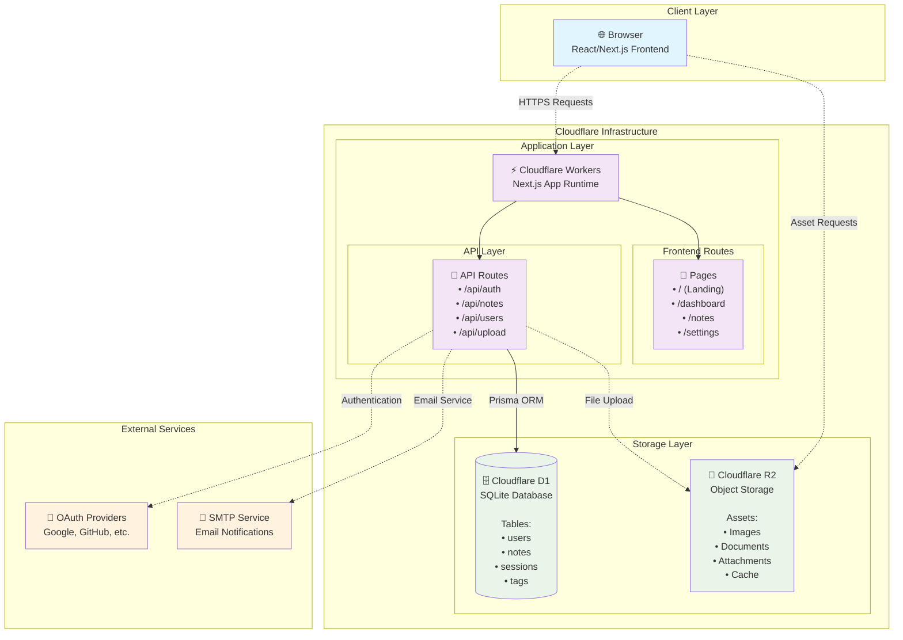

# Note-Taking Web App

A full-stack note-taking web application with user authentication, CRUD operations, search functionality, and theming capabilities. Built with Next.js 15, React 19, Tailwind CSS v4, Cloudflare D1 (SQLite), and Drizzle ORM. Deployed on Cloudflare Workers with R2 storage.

## 🚀 Project Status

**Current Progress: Task 0 - Planning & Setup Complete**

✅ Task Master initialized and configured  
✅ PRD (Product Requirements Document) created  
✅ Database schema designed with edit history support  
✅ Google OAuth integration planned  
✅ 15 development tasks defined and ready
✅ Global Style setup and Tailwind CSS integration

**Next Steps:** Begin Task 1 - Project Setup and Configuration

## 📋 Table of Contents

- [Features](#features)
- [Tech Stack](#tech-stack)
- [Project Structure](#project-structure)
- [Development Tasks](#development-tasks)
- [Getting Started](#getting-started)
- [Documentation](#documentation)
- [Contributing](#contributing)

## ✨ Features

### Core Functionality

- **Note Management**: Create, read, update, and delete notes with rich text content
- **Organization**: Tag-based organization and archive functionality
- **Search**: Advanced search across title, content, and tags with highlighting
- **Auto-save**: Debounced auto-save to prevent data loss

### Authentication & Security

- **Dual Authentication**: Email/password and Google OAuth 2.0 login
- **Protected Routes**: JWT-based authentication with session management
- **Password Recovery**: Email-based password reset for traditional accounts

### User Experience

- **Edit History**: Full undo/redo functionality with version control
- **Themes**: Light/dark mode with font customization
- **Accessibility**: Full keyboard navigation support (Ctrl+Z, Ctrl+Y, etc.)
- **Responsive Design**: Optimized for desktop, tablet, and mobile devices

### Advanced Features (Planned)

- **Real-time Collaboration**: WebSocket-based collaborative editing
- **Image Support**: S3-compatible image upload and storage
- **Version History**: Restore notes to previous versions

## 🛠 Tech Stack



### Frontend

- **Next.js 15.5.2** with App Router
- **React 19.1.0** with React DOM 19.1.0
- **TypeScript 5** for type safety
- **Tailwind CSS v4** for styling with PostCSS
- **TanStack React Query 5.90.1** for state management and caching
- **Zod 4.1.8** for data validation
- **Editor.js 2.31.0** for rich text editing with plugins:
  - Header, Paragraph, List, Quote, Delimiter plugins
- **Radix UI** components for accessible UI primitives
- **Next Themes 0.4.6** for theme management
- **Lucide React** for icons
- **Sonner** for toast notifications

### Backend & API

- **Next.js API Routes** for serverless functions
- **Drizzle ORM 0.44.5** with Drizzle Kit 0.31.4
- **Cloudflare D1** (SQLite) as primary database
- **NextAuth.js 4.24.11** for authentication
- **JWT** for session management with bcryptjs for password hashing
- **@opennextjs/cloudflare 1.8.0** for Cloudflare Workers deployment

### Database & Storage

- **Cloudflare D1** (SQLite) as primary database
- **Drizzle ORM** for database management and migrations
- **Cloudflare R2** for object storage (images, files)
- **Better SQLite3** for local development

### DevOps & Testing

- **OpenNext.js Cloudflare** for Cloudflare Workers deployment
- **Wrangler 4.34.0** for Cloudflare development and deployment
- **GitHub Actions** for CI/CD
- **Vitest 3.2.4** with coverage and UI for testing
- **Testing Library** (React, Jest DOM, User Event) for component testing
- **ESLint 9** with Next.js config for code quality
- **TypeScript** strict mode for type checking

## 📁 Project Structure

```
note-taking-web-app/
├── .wrangler/                # Cloudflare local cache (D1, R2, etc.)
├── .open-next/               # OpenNext.js build output for Cloudflare Workers
├── .taskmaster/              # Task Master configuration
│   ├── docs/                 # Project documentation
│   ├── tasks/                # Individual task files
│   └── config.json           # Task Master settings
├── docs/                     # Additional documentation
│   ├── ENVIRONMENT_SETUP.md  # Development setup guide
│   ├── API_DOCUMENTATION.md  # API documentation
│   └── references/           # Reference documentation
├── migrations/               # Drizzle ORM database migrations
│   ├── meta/                 # Migration metadata
│   └── *.sql                 # SQL migration files
├── scripts/                  # Development and deployment scripts
│   ├── migrate-d1.sh         # D1 migration helper
│   ├── seed.ts               # Database seeding
│   └── test-*.ts             # Testing utilities
├── src/
│   ├── app/                  # Next.js App Router
│   │   ├── (auth)/           # Authenticated routes
│   │   ├── api/              # API routes
│   │   └── api-docs/         # API documentation
│   ├── components/           # Reusable React components
│   │   ├── auth/             # Authentication components
│   │   ├── sidebars/         # Sidebar components
│   │   └── ui/               # UI primitives
│   ├── hooks/                # Custom React hooks
│   ├── lib/                  # Utility functions and configurations
│   └── types/                # TypeScript type definitions
└── public/                   # Static assets
```

## 📋 Development Tasks

The project is organized into 15 main development tasks using Task Master:

1. **Project Setup** - Next.js 15, TypeScript, Tailwind CSS v4, Cloudflare
2. **Database Schema** - Drizzle ORM, Cloudflare D1, OAuth models
3. **Authentication System** - Email/password + Google OAuth
4. **Password Reset** - Email-based recovery system
5. **Note CRUD API** - Create, read, update, delete with history
6. **Search & Filtering** - Advanced search functionality
7. **UI Layout** - Responsive design and navigation
8. **Authentication UI** - Login/register forms with OAuth
9. **Note Editor** - Editor.js rich text editor with plugins
10. **Dashboard UI** - Note listing and management
11. **Theming** - Light/dark mode and font options
12. **Accessibility** - Keyboard navigation and a11y
13. **Real-time Features** - WebSocket collaboration (bonus)
14. **Image Upload** - S3-compatible storage (bonus)
15. **Testing & Deployment** - Comprehensive testing setup

## 🚀 Getting Started

### Prerequisites

- **Node.js 20+** (specified in engines)
- **npm 9+** (specified in engines)
- **Cloudflare Account** for D1 database and R2 storage
- **Wrangler CLI** for Cloudflare development

### Development Setup

1. **Clone the repository**

   ```bash
   git clone <repository-url>
   cd note-taking-web-app
   ```

2. **Install dependencies**

   ```bash
   npm install
   ```

3. **Set up environment variables**

   ```bash
   cp .env.example .env
   # Edit .env with your configuration
   ```

4. **Set up Cloudflare D1 database**

   ```bash
   # Generate database schema
   npm run db:generate
   
   # Apply migrations locally
   npm run db:migrate
   
   # Optional: Seed database with sample data
   npm run db:seed
   ```

5. **Start development server**

   ```bash
   npm run dev           # Start Next.js development server
   ```

### Task Management

This project uses Task Master for development workflow:

```bash
# View all tasks
task-master list

# Get next recommended task
task-master next

# View specific task details
task-master show 1

# Mark task as completed
task-master set-status --id=1 --status=done
```

## 📚 Documentation

- [API Documentation](./docs/API_DOCUMENTATION.md) - **Centralized** API reference with tech stack, schemas, and endpoints
- [Environment Setup](./docs/ENVIRONMENT_SETUP.md) - Complete setup guide for local and production environments
- [Routing & State Management](./docs/ROUTING_AND_STATE_MANAGEMENT.md) - Frontend architecture and navigation
- [Third-Party Integrations](./docs/THIRD_PARTY.md) - External dependencies, Cloudflare services, and integrations

## 🤝 Contributing

1. Follow the Task Master workflow for development
2. Ensure all tests pass before submitting PR
3. Update documentation as needed
4. Follow the established code style and conventions
