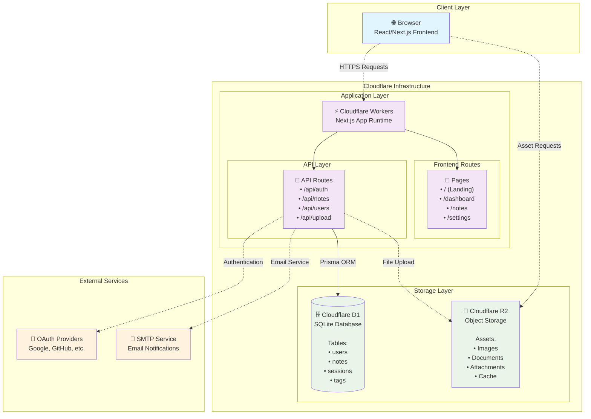

# Note-Taking Web App

A full-stack note-taking web application with user authentication, CRUD operations, search functionality, and theming capabilities. Built with Next.js, Tailwind CSS, PostgreSQL, and Prisma ORM.

## 🚀 Project Status

**Current Progress: Task 0 - Planning & Setup Complete**

✅ Task Master initialized and configured  
✅ PRD (Product Requirements Document) created  
✅ Database schema designed with edit history support  
✅ Google OAuth integration planned  
✅ 15 development tasks defined and ready
✅ Global Style setup and Tailwind CSS integration

**Next Steps:** Begin Task 1 - Project Setup and Configuration

## 📋 Table of Contents

- [Features](#features)
- [Tech Stack](#tech-stack)
- [Project Structure](#project-structure)
- [Development Tasks](#development-tasks)
- [Getting Started](#getting-started)
- [Documentation](#documentation)
- [Contributing](#contributing)

## ✨ Features

### Core Functionality

- **Note Management**: Create, read, update, and delete notes with rich text content
- **Organization**: Tag-based organization and archive functionality
- **Search**: Advanced search across title, content, and tags with highlighting
- **Auto-save**: Debounced auto-save to prevent data loss

### Authentication & Security

- **Dual Authentication**: Email/password and Google OAuth 2.0 login
- **Protected Routes**: JWT-based authentication with session management
- **Password Recovery**: Email-based password reset for traditional accounts

### User Experience

- **Edit History**: Full undo/redo functionality with version control
- **Themes**: Light/dark mode with font customization
- **Accessibility**: Full keyboard navigation support (Ctrl+Z, Ctrl+Y, etc.)
- **Responsive Design**: Optimized for desktop, tablet, and mobile devices

### Advanced Features (Planned)

- **Real-time Collaboration**: WebSocket-based collaborative editing
- **Image Support**: S3-compatible image upload and storage
- **Version History**: Restore notes to previous versions

## 🛠 Tech Stack



### Frontend

- **Next.js 14+** with App Router
- **TypeScript** for type safety
- **Tailwind CSS** for styling
- **React Query** for state management
- **Zod** for data validation
- **WYSIWYG Editor** for rich text editing

### Backend

- **Next.js API Routes** for serverless functions
- **Prisma ORM** with PostgreSQL
- **NextAuth.js** for authentication
- **JWT** for session management
- **Nodemailer** for email services

### Database

- **SQLite** as primary database
- **Prisma** for database management and migrations
- **R2 storage** for images

### DevOps & Testing

- **OpenNext.js** for development for cloudflare
- **GitHub Actions** for CI/CD
- **Vitest** for testing
- **ESLint & Prettier** for code quality

## 📁 Project Structure

```
note-taking-web-app/
├── .wrangler/                # Local Cache file for Cloudflare(e.g. D1, R2, etc.)
├── .open-next/               # Deployment file for Cloudflare Worker
├── .taskmaster/              # Task Master configuration
│   ├── docs/                 # Project documentation
│   ├── tasks/                # Individual task files
│   └── config.json           # Task Master settings
├── docs/                     # Additional documentation
│   ├── ENVIRONMENT_SETUP.md  # Development setup guide
│   ├── ROUTING.md            # Application routing structure
│   └── API_DOC.md            # API documentation
├── src/
│   ├── app/                  # Next.js App Router
│   ├── components/           # Reusable components
│   ├── lib/                  # Utility functions
│   └── types/                # TypeScript type definitions
├── prisma/                   # Database schema and migrations
└── public/                   # Static assets
```

## 📋 Development Tasks

The project is organized into 15 main development tasks using Task Master:

1. **Project Setup** - Next.js, TypeScript, Tailwind CSS, Docker
2. **Database Schema** - Prisma ORM, PostgreSQL, OAuth models
3. **Authentication System** - Email/password + Google OAuth
4. **Password Reset** - Email-based recovery system
5. **Note CRUD API** - Create, read, update, delete with history
6. **Search & Filtering** - Advanced search functionality
7. **UI Layout** - Responsive design and navigation
8. **Authentication UI** - Login/register forms with OAuth
9. **Note Editor** - WYSIWYG editor with undo/redo
10. **Dashboard UI** - Note listing and management
11. **Theming** - Light/dark mode and font options
12. **Accessibility** - Keyboard navigation and a11y
13. **Real-time Features** - WebSocket collaboration (bonus)
14. **Image Upload** - S3-compatible storage (bonus)
15. **Testing & Deployment** - Comprehensive testing setup

## 🚀 Getting Started

### Prerequisites

- Node.js 18+
- PostgreSQL 14+
- Docker & Docker Compose (recommended)

### Development Setup

1. **Clone the repository**

   ```bash
   git clone <repository-url>
   cd note-taking-web-app
   ```

2. **Install dependencies**

   ```bash
   npm install
   ```

3. **Set up environment variables**

   ```bash
   cp .env.example .env
   # Edit .env with your configuration
   ```

4. **Start development environment**

   ```bash
   docker-compose up -d  # Start PostgreSQL
   npm run dev           # Start Next.js development server
   ```

5. **Run database migrations**
   ```bash
   npx prisma migrate dev
   npx prisma generate
   ```

### Task Management

This project uses Task Master for development workflow:

```bash
# View all tasks
task-master list

# Get next recommended task
task-master next

# View specific task details
task-master show 1

# Mark task as completed
task-master set-status --id=1 --status=done
```

## 📚 Documentation

- [API Documentation](./docs/API_DOCUMENTATION.md) - **Centralized** API reference with tech stack, schemas, and endpoints
- [Environment Setup](./docs/ENVIRONMENT_SETUP.md) - Complete setup guide for local and production environments
- [Routing & State Management](./docs/ROUTING_AND_STATE_MANAGEMENT.md) - Frontend architecture and navigation
- [Third-Party Integrations](./docs/THIRD_PARTY.md) - External dependencies, Cloudflare services, and integrations

## 🤝 Contributing

1. Follow the Task Master workflow for development
2. Ensure all tests pass before submitting PR
3. Update documentation as needed
4. Follow the established code style and conventions
