# 📚 Centralized API Documentation

> **📌 CENTRALIZED API DOCUMENTATION**  
> This is the **single source of truth** for all API endpoints, tech stack, schemas, and configurations. All API-related information must be added here, not in separate files.

Complete API reference for the Note-Taking Web App with interactive documentation powered by Scalar API Reference.

## 📋 Quick Reference

| Category           | Endpoints                           | Authentication | Key Features                                  |
| ------------------ | ----------------------------------- | -------------- | --------------------------------------------- |
| **Authentication** | `/register`, `/login`, `/test-auth` | None (public)  | JWT tokens, user management                   |
| **Notes**          | `/notes`, `/notes/{id}`             | Bearer token   | CRUD operations, Editor.js content, filtering |
| **Tags**           | `/tags`                             | Bearer token   | Tag management, usage statistics              |
| **System**         | `/health`, `/docs`                  | None (public)  | Health checks, OpenAPI spec                   |

### Base Configuration

- **Base URL**: `http://localhost:3000/api` (dev) / `https://yourdomain.com/api` (prod)
- **Authentication**: JWT Bearer Token
- **Content-Type**: `application/json`

## 📋 Table of Contents

- [🚀 Quick Access](#-quick-access)
- [🏗️ System Architecture](#️-system-architecture)
- [🛠️ Tech Stack](#️-tech-stack)
- [🗄️ Database Schema](#️-database-schema)
- [🔐 Authentication](#-authentication)
- [📝 API Endpoints](#-api-endpoints)
- [🎯 Features](#-features)
- [🛠️ Development Guide](#-development-guide)
- [📚 Configuration](#-configuration)
- [🔒 Security](#-security)

## 🚀 Quick Access

### Interactive Documentation

- **Development**: [http://localhost:3000/api-docs](http://localhost:3000/api-docs) (No authentication required)
- **Production**: [https://yourdomain.com/api-docs](https://yourdomain.com/api-docs) (Requires authentication)

> **🔒 Production Security**: In production, the API documentation is protected with basic authentication. Contact your administrator for credentials.

### Raw OpenAPI Specification

- **Development**: [http://localhost:3000/api/docs](http://localhost:3000/api/docs)
- **Production**: [https://yourdomain.com/api/docs](https://yourdomain.com/api/docs)

## 🏗️ System Architecture


## 🛠️ Tech Stack

### Backend

- **Framework**: Next.js 14 with App Router
- **Database**: Cloudflare D1 (SQLite) with Prisma ORM
- **Authentication**: JWT tokens with NextAuth.js
- **API Documentation**: next-openapi-gen with Scalar UI
- **Deployment**: Cloudflare Pages with OpenNext.js

### Frontend

- **Framework**: React 19 with Next.js
- **Styling**: Tailwind CSS with Radix UI components
- **State Management**: React Context + useState/useEffect
- **Editor**: Editor.js for rich text editing

### Development Tools

- **Type Safety**: TypeScript with Zod schemas
- **Testing**: Vitest with React Testing Library
- **Linting**: ESLint with Next.js config
- **Package Manager**: npm

## 🚀 Quick Access

### Interactive Documentation

- **Development**: [http://localhost:3000/api-docs](http://localhost:3000/api-docs) (No authentication required)
- **Production**: [https://yourdomain.com/api-docs](https://yourdomain.com/api-docs) (Requires authentication)

> **🔒 Production Security**: In production, the API documentation is protected with basic authentication. Contact your administrator for credentials.

### Raw OpenAPI Specification

- **Development**: [http://localhost:3000/api/docs](http://localhost:3000/api/docs)
- **Production**: [https://yourdomain.com/api/docs](https://yourdomain.com/api/docs)

## 🗄️ Database Schema

### Entity Relationship Diagram


### Database Models

### User Model

```typescript
model User {
  id        String   @id @default(cuid())
  email     String   @unique
  password  String
  createdAt DateTime @default(now())
  updatedAt DateTime @updatedAt
  notes     Note[]
}
```

### Note Model

```typescript
model Note {
  id         String   @id @default(cuid())
  userId     String
  title      String
  content    JSON     // Editor.js content in JSON format
  isArchived Boolean  @default(false)
  createdAt  DateTime @default(now())
  updatedAt  DateTime @updatedAt
  lastEdited DateTime @default(now())
  user       User     @relation(fields: [userId], references: [id], onDelete: Cascade)
  noteTags   NoteTag[] // Many-to-many relationship with tags
}
```

### Tag Model

```typescript
model Tag {
  id        String   @id @default(cuid())
  name      String
  userId    String
  createdAt DateTime @default(now())
  updatedAt DateTime @updatedAt
  user      User     @relation(fields: [userId], references: [id], onDelete: Cascade)
  noteTags  NoteTag[] // Many-to-many relationship with notes
}
```

### NoteTag Model (Junction Table)

```typescript
model NoteTag {
  noteId String
  tagId  String
  note   Note @relation(fields: [noteId], references: [id], onDelete: Cascade)
  tag    Tag  @relation(fields: [tagId], references: [id], onDelete: Cascade)

  @@id([noteId, tagId])
}
```

### Database Configuration

- **Provider**: SQLite (Cloudflare D1)
- **ORM**: Prisma with driver adapters
- **Migrations**: Prisma migrate with Cloudflare D1 integration
- **Connection**: Environment variable `DATABASE_URL`

## 🔐 Authentication

### JWT Bearer Token

Most protected endpoints require authentication:

```http
Authorization: Bearer <your-jwt-token>
```

### Getting a Token

1. Register: `POST /api/register`
2. Login: `POST /api/login`
3. Use the returned `token` in Authorization header

## 📝 API Endpoints

### API Flow Diagram


### Available Endpoints

### Authentication

#### Register User

- **POST** `/api/register`
- **Description**: Register a new user with email and password
- **Body**: `{ "email": "user@example.com", "password": "password123" }`
- **Response**: User object with ID, email, and creation timestamp

#### Login User

- **POST** `/api/login`
- **Description**: Login with email and password
- **Body**: `{ "email": "user@example.com", "password": "password123" }`
- **Response**: JWT token and user information

#### Test Authentication

- **GET** `/api/test-auth`
- **Description**: Verify JWT token is valid
- **Headers**: `Authorization: Bearer <token>`
- **Response**: User ID and success message

#### Verify API Documentation Access

- **POST** `/api/verify-api-docs-auth`
- **Description**: Verify API docs authentication with username and password
- **Body**: `{ "username": "admin", "password": "password" }`
- **Response**: Authentication success status
- **Note**: This endpoint is used by the protected API documentation interface

### Notes Management

#### Get Notes

- **GET** `/api/notes`
- **Description**: Get notes with optional filters
- **Headers**: `Authorization: Bearer <token>`
- **Query Parameters**:
  - `query` (optional): Text search in title and content
  - `tags` (optional): Comma-separated tag names to filter by
  - `isArchived` (optional): Filter by archive status (true/false)
  - `page` (optional): Page number for pagination (default: 1)
  - `limit` (optional): Items per page (default: 20)
- **Response**: Paginated list of notes with tags

#### Create Note

- **POST** `/api/notes`
- **Description**: Create a new note with title, content, and optional tags
- **Headers**: `Authorization: Bearer <token>`
- **Body**:
  ```json
  {
    "title": "Note Title",
    "content": {
      "time": 1640995200000,
      "blocks": [
        {
          "id": "block1",
          "type": "header",
          "data": { "text": "Header Text", "level": 1 }
        }
      ],
      "version": "2.31.0"
    },
    "tags": ["tag1", "tag2"]
  }
  ```
- **Response**: Created note with generated ID and tags

#### Get Note by ID

- **GET** `/api/notes/{id}`
- **Description**: Retrieve a specific note by its ID with tags
- **Headers**: `Authorization: Bearer <token>`
- **Response**: Note object with content and associated tags

#### Update Note

- **PUT** `/api/notes/{id}`
- **Description**: Update an existing note's title, content, tags, or archive status
- **Headers**: `Authorization: Bearer <token>`
- **Body**:
  ```json
  {
    "title": "Updated Title",
    "content": {
      /* Editor.js content */
    },
    "tags": ["updated-tag"],
    "isArchived": false
  }
  ```
- **Response**: Updated note object

#### Delete Note

- **DELETE** `/api/notes/{id}`
- **Description**: Permanently delete a note and its associated tags
- **Headers**: `Authorization: Bearer <token>`
- **Response**: Success confirmation message

### Tags Management

#### Get Tags

- **GET** `/api/tags`
- **Description**: Retrieve all user tags with note counts and usage statistics
- **Headers**: `Authorization: Bearer <token>`
- **Response**: List of tags with usage counts

### System

#### Health Check

- **GET** `/api/health`
- **Description**: Health Check for Database Connection - ping the database and return the number of users and notes
- **Response**: System status, database status, and statistics

#### Get OpenAPI Specification

- **GET** `/api/docs`
- **Description**: Get the raw OpenAPI specification in JSON format
- **Response**: Complete OpenAPI 3.0 specification

## 🛠️ Development Guide

### OpenAPI Documentation Workflow


### How to Edit API Documentation

### 1. Update API Routes

Edit the route files in `src/app/api/` and add OpenAPI annotations:

```typescript
/**
 * Endpoint Title
 * @description Detailed description of what this endpoint does
 * @auth bearer
 * @body YourRequestSchema
 * @response YourResponseSchema:Description of response
 * @responseSet auth
 * @openapi
 */
export async function POST(request: Request) {
  // Your implementation
}
```

### 2. Update Schemas

Edit `src/schemas/auth.ts` to add new Zod schemas:

```typescript
export const YourSchema = z.object({
  field: z.string().describe('Field description'),
  // ... other fields
});

export type YourType = z.infer<typeof YourSchema>;
```

### 3. Regenerate Documentation

Run the generation command:

```bash
npx next-openapi-gen generate
```

### 4. Configuration Options

Edit `next.openapi.json` to customize:

- **API Info**: Title, description, version
- **Servers**: Base URLs for different environments
- **Security Schemes**: Authentication methods
- **Response Sets**: Common error responses
- **Error Config**: Error message templates

### 5. Available Annotations

| Annotation     | Description                   | Example                                  |
| -------------- | ----------------------------- | ---------------------------------------- |
| **Title**      | First line - endpoint title   | `Get notes`                              |
| `@description` | Detailed endpoint description | `@description Get notes with filters`    |
| `@auth`        | Authentication method         | `@auth bearer` or `@auth none`           |
| `@body`        | Request body schema           | `@body LoginRequestSchema`               |
| `@response`    | Response schema               | `@response UserResponseSchema:User data` |
| `@responseSet` | Use predefined response set   | `@responseSet auth`                      |
| `@add`         | Add custom response           | `@add 409:ConflictResponse`              |
| `@openapi`     | Enable OpenAPI generation     | `@openapi`                               |

### 6. Response Sets

Predefined response sets in `next.openapi.json`:

- **common**: 400, 500 errors
- **auth**: 400, 401, 403, 500 errors
- **public**: 400, 500 errors

## 🔧 Development Workflow

### Adding New Endpoints

1. **Create Route File**: `src/app/api/your-endpoint/route.ts`
2. **Add OpenAPI Annotations**: Use the annotation format above
3. **Define Schemas**: Add Zod schemas in `src/schemas/`
4. **Regenerate Docs**: Run `npx next-openapi-gen generate`
5. **Test**: Visit `http://localhost:3000/api-docs`

### Testing API Endpoints

Use the interactive documentation at `/api-docs` or test with curl:

```bash
# Test health endpoint
curl http://localhost:3000/api/health

# Test login
curl -X POST http://localhost:3000/api/login \
  -H "Content-Type: application/json" \
  -d '{"email":"test@example.com","password":"password123"}'

# Test protected endpoint
curl -H "Authorization: Bearer YOUR_TOKEN" \
  http://localhost:3000/api/test-auth

# Get notes with filters
curl -H "Authorization: Bearer YOUR_TOKEN" \
  "http://localhost:3000/api/notes?query=search&tags=work,important&page=1&limit=10"

# Create a note
curl -X POST http://localhost:3000/api/notes \
  -H "Authorization: Bearer YOUR_TOKEN" \
  -H "Content-Type: application/json" \
  -d '{
    "title": "My Note",
    "content": {
      "time": 1640995200000,
      "blocks": [
        {
          "id": "block1",
          "type": "header",
          "data": {"text": "Hello World", "level": 1}
        }
      ],
      "version": "2.31.0"
    },
    "tags": ["example", "test"]
  }'

# Get tags
curl -H "Authorization: Bearer YOUR_TOKEN" \
  http://localhost:3000/api/tags
```

## 📚 Configuration

### Project Structure


### Configuration Files

| File                                 | Purpose         | Description                                 |
| ------------------------------------ | --------------- | ------------------------------------------- |
| `next.openapi.json`                  | Main Config     | OpenAPI generation settings, response sets  |
| `src/schemas/auth.ts`                | Auth Schemas    | Zod schemas for authentication endpoints    |
| `src/schemas/notes.ts`               | Notes Schemas   | Zod schemas for notes and Editor.js content |
| `src/lib/schema.ts`                  | Database Schema | Drizzle ORM table definitions               |
| `src/components/swagger-wrapper.tsx` | UI Component    | Scalar API documentation wrapper            |
| `src/app/api-docs/page.tsx`          | Docs Page       | Protected documentation page                |
| `public/openapi.json`                | Generated Spec  | Auto-generated OpenAPI specification        |

## 🎯 Features

### API Documentation

- **Interactive Testing**: Test endpoints directly from documentation
- **Real-time Validation**: Schema validation with examples
- **Modern UI**: Clean, responsive Scalar interface
- **Auto-generation**: Documentation updates automatically from code
- **Type Safety**: Full TypeScript support with Zod schemas

### Notes Management

- **Rich Text Editor**: Full Editor.js integration with multiple block types
- **Advanced Search**: Text search across title and content
- **Tag System**: Relational tags with many-to-many relationships
- **Filtering**: Filter by tags, archive status, and pagination
- **CRUD Operations**: Complete Create, Read, Update, Delete functionality

### Authentication & Security

- **JWT Authentication**: Secure token-based authentication
- **User Isolation**: Each user can only access their own data
- **Protected Documentation**: API docs protected in production
- **Input Validation**: Comprehensive Zod schema validation

## 🚦 Status Codes

| Code | Description                    |
| ---- | ------------------------------ |
| 200  | Success                        |
| 201  | Created                        |
| 400  | Bad Request (Validation Error) |
| 401  | Unauthorized                   |
| 403  | Forbidden                      |
| 404  | Not Found                      |
| 409  | Conflict                       |
| 500  | Internal Server Error          |

## 🔒 Security

### Authentication Flow



```mermaid
sequenceDiagram
    participant C as Client
    participant A as Auth API
    participant DB as Database
    participant P as Protected API

    C->>A: POST /register (email, password)
    A->>DB: Create user with hashed password
    DB-->>A: User created
    A-->>C: 201 Created + User info

    C->>A: POST /login (email, password)
    A->>DB: Verify credentials
    DB-->>A: User found
    A->>A: Generate JWT token
    A-->>C: 200 OK + JWT token

    C->>P: API Request + Authorization: Bearer <token>
    P->>P: Verify JWT token
    P->>DB: Execute authorized operation
    DB-->>P: Operation result
    P-->>C: API Response
```

### Production Security

### API Documentation Protection

The API documentation (`/api-docs`) is protected with basic authentication in production:

- **Development**: No authentication required
- **Production**: Username/password authentication required

#### Environment Variables

```bash
# API Documentation Authentication
API_DOCS_USERNAME=your-username
API_DOCS_PASSWORD=your-secure-password
```

#### Default Credentials

If environment variables are not set:

- **Username**: `admin`
- **Password**: `admin123`

> **⚠️ Security Warning**: Always set custom credentials in production!

### Authentication Flow

1. User visits `/api-docs` in production
2. System checks for existing authentication session
3. If not authenticated, shows login form
4. User enters credentials
5. System validates against environment variables
6. If valid, grants access to API documentation
7. Session persists until logout or browser close

## 📋 Documentation Rules

### **Centralized Documentation Policy**

- **ALL API endpoints MUST be documented in this file (`API_DOCUMENTATION.md`)**
- **NO separate API documentation files should be created**
- **This is the single source of truth for all API documentation**

### **Adding New Endpoints**

When adding new API endpoints:

1. **Add OpenAPI annotations** to the route file:

   ```typescript
   /**
    * Endpoint Title
    * @description Detailed description of what this endpoint does
    * @auth bearer
    * @body YourRequestSchema
    * @response YourResponseSchema:Description
    * @responseSet auth
    * @openapi
    */
   ```

2. **Add endpoint documentation** to this file in the format:

   ```markdown
   #### Endpoint Name

   - **METHOD** `/api/endpoint-path`
   - **Description**: What the endpoint does
   - **Body**: Request body schema (if applicable)
   - **Headers**: Required headers (if applicable)
   - **Response**: Response schema description
   - **Errors**: Possible error responses
   ```

3. **Regenerate documentation**:
   ```bash
   npx next-openapi-gen generate
   ```

## 🔄 Migration from Swagger UI

This documentation system has been migrated from `swagger-jsdoc` to `next-openapi-gen` for better React 19 compatibility and modern tooling.
