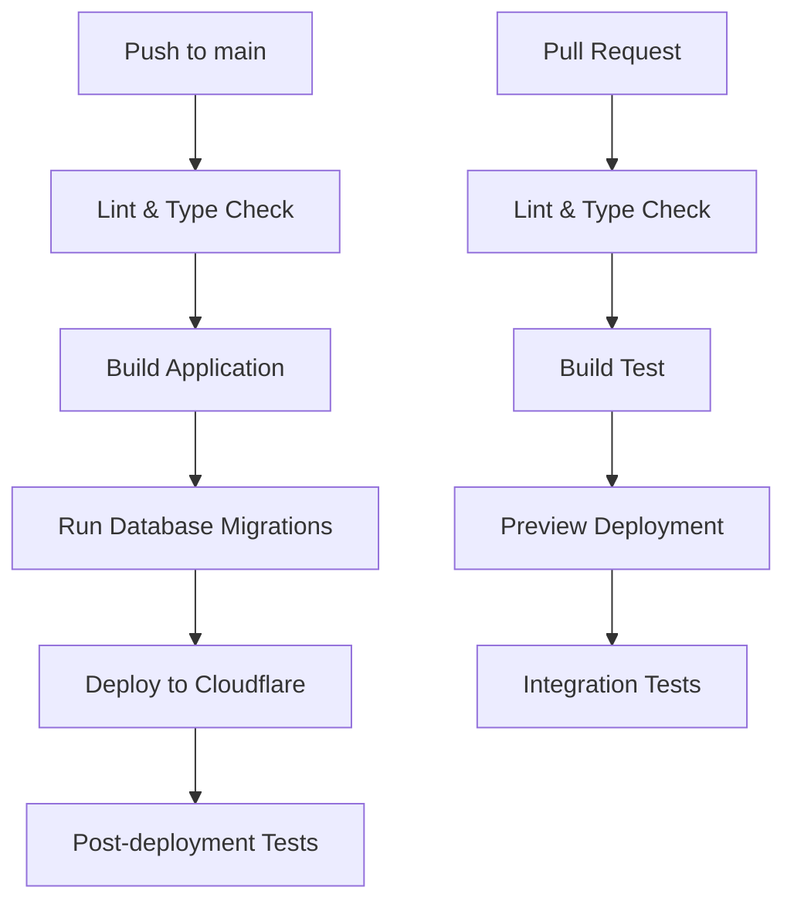

# Environment Setup Guide

This guide will help you set up the development environment for the Note-Taking Web App, deployed on Cloudflare's platform.

## Prerequisites

### System Requirements

- **Node.js** 20.0.0 or higher
- **npm** 9.0.0 or higher
- **Git** for version control
- **Cloudflare Account** (free tier is sufficient)

### Development Tools (Recommended)

- **VS Code** or **Cursor** with extensions:
  - Prisma
  - Tailwind CSS IntelliSense
  - TypeScript and JavaScript Language Features
  - ESLint
  - Prettier
  - Wrangler (Cloudflare extension)

## Quick Start

### 1. Clone and Install

```bash
# Clone the repository
git clone <repository-url>
cd note-taking-web-app

# Install dependencies
npm install

# Install Task Master globally (recommended)
npm install -g task-master-ai
```

### 2. Environment Configuration

Create environment files from templates:

```bash
# Copy environment template
cp .dev.vars .env

# Edit environment variables for local development
nano .env  # or your preferred editor
```

#### Required Environment Variables

Update your `.env` file with the following variables:

```bash
# Database (for local development)
DATABASE_URL="file:./prisma/dev.db"

# JWT Authentication (REQUIRED - used in auth.ts)
JWT_SECRET=your-super-secret-jwt-key-here-at-least-32-characters-long

# NextAuth.js Configuration
NEXTAUTH_SECRET=your-nextauth-secret-here-at-least-32-characters-long
NEXTAUTH_URL=http://localhost:3000

# API Documentation Authentication (Production)
API_DOCS_USERNAME=admin
API_DOCS_PASSWORD=your-secure-password-here

# Cloudflare D1 Database ID (obtained after creating D1 database)
D1_DATABASE_ID=your-d1-database-id

# Development Environment
NODE_ENV=development

# Optional: Google OAuth (TD;LR - will be implemented with backend)
GOOGLE_CLIENT_ID=your-google-client-id
GOOGLE_CLIENT_SECRET=your-google-client-secret

# Optional: Email Configuration (TD;LR - will be implemented with backend)
SMTP_HOST=smtp.gmail.com
SMTP_PORT=587
SMTP_USER=your-email@gmail.com
SMTP_PASSWORD=your-app-password
```

## Cloudflare Deployment Setup

### 1. Create Cloudflare Account and Resources

**Free tier is sufficient for development:**

| Service | Usage                | Free Tier Limits     |
| ------- | -------------------- | -------------------- |
| Workers | Serverless Functions | 100,000 requests/day |
| D1      | SQLite Database      | 5GB storage          |
| R2      | Object Storage       | 10GB/month           |

### 2. Install and Setup Wrangler CLI

```bash
# Install Wrangler globally
npm install -g wrangler

# Login to Cloudflare (opens OAuth flow in browser)
wrangler login

# Verify login
wrangler whoami
```

### 3. Create Cloudflare Resources

```bash
# Create D1 database for your app
wrangler d1 create note-taking-app

# Create R2 bucket for caching (optional but recommended)
wrangler r2 bucket create note-taking-app-cache
```

After creating the D1 database, copy the database ID from the output and update your `.dev.vars` file:

```bash
# Add to .dev.vars
D1_DATABASE_ID=your-actual-database-id-here
```

### 4. Configure wrangler.jsonc

The project includes a pre-configured `wrangler.jsonc` file. Update the following values:

```jsonc
{
  "$schema": "node_modules/wrangler/config-schema.json",
  "main": ".open-next/worker.js",
  "name": "note-taking-app", // Change to your app name
  "compatibility_date": "2024-12-30",
  "compatibility_flags": ["nodejs_compat", "global_fetch_strictly_public"],
  "assets": {
    "directory": ".open-next/assets",
    "binding": "ASSETS"
  },
  "services": [
    {
      "binding": "WORKER_SELF_REFERENCE",
      "service": "note-taking-app" // Must match "name" above
    }
  ],
  "r2_buckets": [
    {
      "binding": "NEXT_INC_CACHE_R2_BUCKET",
      "bucket_name": "note-taking-app-cache"
    }
  ],
  "d1_databases": [
    {
      "binding": "DB",
      "database_name": "note-taking-app",
      "database_id": "your-d1-database-id"
    }
  ]
}
```

### 5. Local Development

```bash
# Start local development server
npm run dev

# Generate Cloudflare types (optional)
npm run cf-typegen
```

### 6. Available Scripts

The project includes comprehensive scripts for development, testing, and deployment:

#### Development Scripts

```bash
npm run dev              # Start development server
npm run build            # Build for production
npm run start            # Start production server
npm run lint             # Run ESLint
npm run lint:fix         # Fix ESLint issues
npm run type-check       # TypeScript type checking
npm run test             # Run tests
```

#### Database Scripts

```bash
npm run db:generate      # Generate Prisma client
npm run db:migrate       # Create and apply migration (dev)
npm run db:migrate:local # Apply migrations to local D1
npm run db:migrate:deploy # Apply migrations to remote D1
npm run db:studio        # Open Prisma Studio
npm run db:seed          # Seed database with sample data
npm run db:reset         # Reset database
npm run db:status        # Check migration status
npm run db:tables        # Show database tables
```

#### Deployment Scripts

```bash
npm run preview          # Preview deployment locally
npm run deploy           # Deploy to Cloudflare (production)
npm run deploy:preview   # Deploy preview version
npm run upload           # Alternative deployment method
npm run cf-typegen       # Generate Cloudflare types
```

#### CI/CD Integration

These scripts are used in the GitHub Actions workflow:

- `npm run lint` - Code quality checks
- `npm run type-check` - TypeScript validation
- `npm run test` - Run test suite
- `npm run db:generate` - Prepare database client
- `npm run db:migrate:deploy` - Apply production migrations
- `npm run deploy` - Deploy to production

### 7. Environment Variables in Production

Set production environment variables in Cloudflare Dashboard:

1. Go to Workers & Pages > Your App > Settings > Environment Variables
2. Add the following variables:
   - `JWT_SECRET`: Generate a secure random string (at least 32 characters)
   - `NEXTAUTH_SECRET`: Generate a secure random string (at least 32 characters)
   - `NEXTAUTH_URL`: Your production domain
   - `DATABASE_URL`: Your D1 database connection string
   - `D1_DATABASE_ID`: Your D1 database ID
   - `API_DOCS_USERNAME`: Username for API documentation access (e.g., "admin")
   - `API_DOCS_PASSWORD`: Secure password for API documentation access
   - `NODE_ENV`: Set to "production"
   - Other OAuth and SMTP credentials (TD;LR)

## 🔌 Third-Party Integrations

### Cloudflare Services

#### Cloudflare D1 Database

- **Purpose**: Serverless SQLite database for production
- **Configuration**: Set `D1_DATABASE_ID` in Cloudflare Dashboard
- **Migration**: Use `wrangler d1 migrations apply` for schema updates
- **Local Development**: SQLite file (`prisma/dev.db`)

#### Cloudflare Workers

- **Purpose**: Serverless function execution environment
- **Configuration**: Automatic with OpenNext.js deployment
- **Runtime**: V8 JavaScript engine with Web APIs

#### Cloudflare Pages

- **Purpose**: Static site hosting with edge functions
- **Configuration**: Connected to GitHub repository
- **Custom Domain**: Configure in Cloudflare Dashboard
- **Environment Variables**: Set in Pages settings

### External Dependencies

#### Prisma ORM

- **Purpose**: Database ORM with type safety
- **Configuration**: `prisma/schema.prisma`
- **Client Generation**: `npm run db:generate`
- **Migrations**: `npm run db:migrate`

#### NextAuth.js

- **Purpose**: Authentication framework
- **Configuration**: `src/lib/auth-config.ts`
- **Providers**: JWT tokens (custom implementation)
- **Session Management**: Server-side sessions

#### OpenNext.js

- **Purpose**: Next.js deployment for Cloudflare
- **Configuration**: `open-next.config.ts`
- **Build Process**: `npx opennextjs-cloudflare build`
- **Deployment**: `npx opennextjs-cloudflare deploy`

#### Scalar API Reference

- **Purpose**: Interactive API documentation
- **Configuration**: `next.openapi.json`
- **Generation**: `npx next-openapi-gen generate`
- **UI**: Modern, interactive API explorer

### Integration Setup

#### Cloudflare Account Setup

1. Create Cloudflare account
2. Navigate to Workers & Pages
3. Create new D1 database
4. Create new Pages project
5. Connect GitHub repository

#### Environment Configuration

```bash
# Database
DATABASE_URL=your-d1-database-connection-string
D1_DATABASE_ID=your-database-id

# JWT Authentication (REQUIRED)
JWT_SECRET=your-super-secret-jwt-key-here-at-least-32-characters-long

# NextAuth Configuration
NEXTAUTH_SECRET=your-secret-key-at-least-32-characters-long
NEXTAUTH_URL=https://your-domain.com

# API Documentation
API_DOCS_USERNAME=admin
API_DOCS_PASSWORD=secure-password

# Environment
NODE_ENV=production

# Cloudflare API (for deployment)
CLOUDFLARE_API_TOKEN=your-api-token
CLOUDFLARE_ACCOUNT_ID=your-account-id
```

## 🚀 Deployment Configuration

### GitHub Actions Workflow

The deployment process includes OpenAPI documentation generation and production security:

#### Build Process

1. Install dependencies
2. Generate Prisma client
3. **Generate OpenAPI documentation** (NEW)
4. Build OpenNext for Cloudflare
5. Verify build outputs including OpenAPI docs
6. Create compressed archive with all files

#### OpenAPI Documentation Generation

```yaml
- name: Generate OpenAPI documentation
  run: npx next-openapi-gen generate
- name: Build OpenNext for Cloudflare
  run: npx opennextjs-cloudflare build
```

#### Enhanced Artifact Verification

- Added check for OpenAPI documentation file
- Updated compressed archive to include all necessary files

### Production Security Features

#### API Documentation Protection

- **Development**: No authentication required
- **Production**: Basic username/password authentication
- **Session Management**: Uses `sessionStorage` for temporary authentication
- **Environment Variables**: Configurable credentials

#### Security Implementation

- `src/components/protected-api-docs.tsx` - Protected API documentation component
- `src/app/api/verify-api-docs-auth/route.ts` - Authentication endpoint
- `src/test/api/verify-api-docs-auth.test.ts` - Authentication tests

## CI/CD with GitHub Actions

### Deployment Workflow



### Trigger Conditions

| Event               | Branch | Action                     |
| ------------------- | ------ | -------------------------- |
| `push`              | `main` | Full deployment pipeline   |
| `pull_request`      | `*`    | Preview deployment + tests |
| `workflow_dispatch` | `main` | Manual deployment          |
| `schedule`          | `main` | Nightly health checks      |

### GitHub Actions Setup

Create `.github/workflows/deploy.yml`:

```yaml
name: Deploy to Cloudflare

on:
  push:
    branches: [main]
  pull_request:
    branches: [main]
  workflow_dispatch:

jobs:
  lint-and-test:
    name: Lint and Test
    runs-on: ubuntu-latest
    steps:
      - uses: actions/checkout@v4
      - uses: actions/setup-node@v4
        with:
          node-version: "20"
          cache: "npm"

      - name: Install dependencies
        run: npm ci

      - name: Lint code
        run: npm run lint

      - name: Type check
        run: npm run type-check

      - name: Run tests
        run: npm run test

  build:
    name: Build Application
    runs-on: ubuntu-latest
    needs: lint-and-test
    steps:
      - uses: actions/checkout@v4
      - uses: actions/setup-node@v4
        with:
          node-version: "20"
          cache: "npm"

      - name: Install dependencies
        run: npm ci

      - name: Generate Prisma client
        run: npm run db:generate

      - name: Build application
        run: npm run build

      - name: Upload build artifacts
        uses: actions/upload-artifact@v4
        with:
          name: build-files
          path: .next

  deploy:
    name: Deploy to Cloudflare
    runs-on: ubuntu-latest
    needs: build
    if: github.ref == 'refs/heads/main'
    steps:
      - uses: actions/checkout@v4
      - uses: actions/setup-node@v4
        with:
          node-version: "20"
          cache: "npm"

      - name: Install dependencies
        run: npm ci

      - name: Download build artifacts
        uses: actions/download-artifact@v4
        with:
          name: build-files
          path: .next

      - name: Apply database migrations
        run: npm run db:migrate:deploy
        env:
          CLOUDFLARE_API_TOKEN: ${{ secrets.CLOUDFLARE_API_TOKEN }}

      - name: Deploy to Cloudflare
        run: npm run deploy
        env:
          CLOUDFLARE_API_TOKEN: ${{ secrets.CLOUDFLARE_API_TOKEN }}

  preview:
    name: Preview Deployment
    runs-on: ubuntu-latest
    needs: build
    if: github.event_name == 'pull_request'
    steps:
      - uses: actions/checkout@v4
      - uses: actions/setup-node@v4
        with:
          node-version: "20"
          cache: "npm"

      - name: Install dependencies
        run: npm ci

      - name: Download build artifacts
        uses: actions/download-artifact@v4
        with:
          name: build-files
          path: .next

      - name: Deploy preview
        run: npm run deploy:preview
        env:
          CLOUDFLARE_API_TOKEN: ${{ secrets.CLOUDFLARE_API_TOKEN }}
```

### Required GitHub Secrets

Configure the following secrets in your GitHub repository settings:

| Secret                  | Description                                        | How to obtain                                  |
| ----------------------- | -------------------------------------------------- | ---------------------------------------------- |
| `CLOUDFLARE_API_TOKEN`  | Cloudflare API token with Workers:Edit permissions | Cloudflare Dashboard > My Profile > API Tokens |
| `CLOUDFLARE_ACCOUNT_ID` | Your Cloudflare account ID                         | Cloudflare Dashboard > Right sidebar           |

## Database Setup (D1 + Prisma ORM)

### ✅ Database Status: Configured and Ready

The database layer has been implemented using:

- **Cloudflare D1**: SQLite-compatible serverless database
- **Prisma ORM**: Type-safe database client with full TypeScript support
- **Database Schema**: Complete with User and Note models

### ✅ D1 Database Configuration

Your D1 database has been created and configured:

- **Database Name**: `noteapp`
- **Database ID**: `d1863666-f3e9-4a11-9931-358805aa29fd`
- **Binding**: `DB` (configured in `wrangler.jsonc`)

### Database Operations

```bash
# Generate Prisma client
npx prisma generate

# Create and apply migrations
npx prisma migrate dev --name migration_name

# Database GUI for local development
npx prisma studio

# D1-specific migration commands
npx wrangler d1 migrations apply noteapp          # Apply to local D1
npx wrangler d1 migrations apply noteapp --remote # Apply to remote D1

# Helper script for D1 operations
./scripts/migrate-d1.sh apply                     # Apply all migrations
./scripts/migrate-d1.sh list                      # Check migration status
./scripts/migrate-d1.sh tables                    # Show database tables
```

### Current Database Schema

```prisma
model User {
  id        String   @id @default(cuid())
  email     String   @unique
  password  String
  createdAt DateTime @default(now())
  updatedAt DateTime @updatedAt
  notes     Note[]
}

model Note {
  id         String   @id @default(cuid())
  userId     String
  title      String
  content    String
  tags       String   // Stored as comma-separated string for SQLite compatibility
  isArchived Boolean  @default(false)
  createdAt  DateTime @default(now())
  updatedAt  DateTime @updatedAt
  lastEdited DateTime @default(now())
  user       User     @relation(fields: [userId], references: [id], onDelete: Cascade)
}
```

### Tags Handling

Since SQLite doesn't support arrays natively, tags are stored as comma-separated strings. Helper functions are available in `src/types/database.ts`:

- `parseTags(tagsString)` - Convert string to array
- `formatTags(tagsArray)` - Convert array to string

### Migration Files

- **Prisma Migrations**: `prisma/migrations/` (for local development)
- **D1 Migrations**: `migrations/` (for D1 database deployment)
- **Migration Helper**: `scripts/migrate-d1.sh` (automated migration script)

## Troubleshooting

### Common Issues

1. **Wrangler Login Issues**

   ```bash
   # Clear Wrangler cache and re-login
   wrangler logout
   wrangler login
   ```

2. **Build Errors**

   ```bash
   # Clear Next.js cache
   rm -rf .next
   npm run build
   ```

3. **Environment Variables Not Loading**
   - Ensure `.dev.vars` exists for local development
   - Check Cloudflare Dashboard for production variables

### Support Resources

- [OpenNext.js Documentation](https://opennext.js.org/cloudflare)
- [Cloudflare Workers Documentation](https://developers.cloudflare.com/workers/)
- [Cloudflare D1 Documentation](https://developers.cloudflare.com/d1/)
- [Wrangler CLI Documentation](https://developers.cloudflare.com/workers/wrangler/)

## Next Steps

1. Complete the environment setup following this guide
2. Run `npm run dev` to start local development
3. Implement database schema (TD;LR)
4. Set up authentication system (TD;LR)
5. Deploy to Cloudflare using `npm run deploy`
