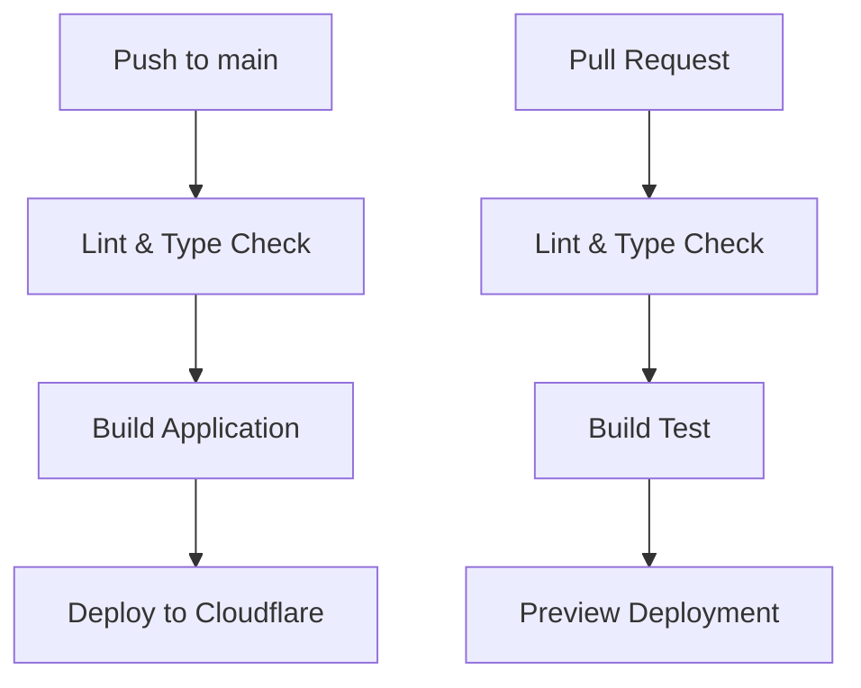

# Environment Setup Guide

This guide will help you set up the development environment for the Note-Taking Web App, deployed on Cloudflare's platform.

## Prerequisites

### System Requirements

- **Node.js** 18.0.0 or higher
- **npm** 9.0.0 or higher
- **Git** for version control
- **Cloudflare Account** (free tier is sufficient)

### Development Tools (Recommended)

- **VS Code** or **Cursor** with extensions:
  - Prisma
  - Tailwind CSS IntelliSense
  - TypeScript and JavaScript Language Features
  - ESLint
  - Prettier
  - Wrangler (Cloudflare extension)

## Quick Start

### 1. Clone and Install

```bash
# Clone the repository
git clone <repository-url>
cd note-taking-web-app

# Install dependencies
npm install

# Install Task Master globally (recommended)
npm install -g task-master-ai
```

### 2. Environment Configuration

Create environment files from templates:

```bash
# Copy environment template
cp .dev.vars .env

# Edit environment variables for local development
nano .env  # or your preferred editor
```

#### Required Environment Variables

Update your `.env` file with the following variables:

```bash
# Database (for local development)
DATABASE_URL="file:./prisma/dev.db"

# NextAuth.js (TD;LR - will be implemented with backend)
NEXTAUTH_SECRET=your-nextauth-secret-here
NEXTAUTH_URL=https://your-domain.com

# Google OAuth (TD;LR - will be implemented with backend)
GOOGLE_CLIENT_ID=your-google-client-id
GOOGLE_CLIENT_SECRET=your-google-client-secret

# Email Configuration (TD;LR - will be implemented with backend)
SMTP_HOST=smtp.gmail.com
SMTP_PORT=587
SMTP_USER=your-email@gmail.com
SMTP_PASSWORD=your-app-password

# Cloudflare D1 Database ID (obtained after creating D1 database)
D1_DATABASE_ID=your-d1-database-id
```

## Cloudflare Deployment Setup

### 1. Create Cloudflare Account and Resources

**Free tier is sufficient for development:**

| Service | Usage                | Free Tier Limits     |
| ------- | -------------------- | -------------------- |
| Workers | Serverless Functions | 100,000 requests/day |
| D1      | SQLite Database      | 5GB storage          |
| R2      | Object Storage       | 10GB/month           |

### 2. Install and Setup Wrangler CLI

```bash
# Install Wrangler globally
npm install -g wrangler

# Login to Cloudflare (opens OAuth flow in browser)
wrangler login

# Verify login
wrangler whoami
```

### 3. Create Cloudflare Resources

```bash
# Create D1 database for your app
wrangler d1 create note-taking-app

# Create R2 bucket for caching (optional but recommended)
wrangler r2 bucket create note-taking-app-cache
```

After creating the D1 database, copy the database ID from the output and update your `.dev.vars` file:

```bash
# Add to .dev.vars
D1_DATABASE_ID=your-actual-database-id-here
```

### 4. Configure wrangler.jsonc

The project includes a pre-configured `wrangler.jsonc` file. Update the following values:

```jsonc
{
  "$schema": "node_modules/wrangler/config-schema.json",
  "main": ".open-next/worker.js",
  "name": "note-taking-app", // Change to your app name
  "compatibility_date": "2024-12-30",
  "compatibility_flags": ["nodejs_compat", "global_fetch_strictly_public"],
  "assets": {
    "directory": ".open-next/assets",
    "binding": "ASSETS"
  },
  "services": [
    {
      "binding": "WORKER_SELF_REFERENCE",
      "service": "note-taking-app" // Must match "name" above
    }
  ],
  "r2_buckets": [
    {
      "binding": "NEXT_INC_CACHE_R2_BUCKET",
      "bucket_name": "note-taking-app-cache"
    }
  ],
  "d1_databases": [
    {
      "binding": "DB",
      "database_name": "note-taking-app",
      "database_id": "your-d1-database-id"
    }
  ]
}
```

### 5. Local Development

```bash
# Start local development server
npm run dev

# Generate Cloudflare types (optional)
npm run cf-typegen
```

### 6. Deployment Commands

The project includes pre-configured deployment scripts using OpenNext.js:

```bash
# Preview deployment locally
npm run preview

# Deploy to Cloudflare
npm run deploy

# Build and upload (alternative deployment method)
npm run upload
```

### 7. Environment Variables in Production

Set production environment variables in Cloudflare Dashboard:

1. Go to Workers & Pages > Your App > Settings > Environment Variables
2. Add the following variables:
   - `NEXTAUTH_SECRET`: Generate a secure random string
   - `NEXTAUTH_URL`: Your production domain
   - `D1_DATABASE_ID`: Your D1 database ID
   - Other OAuth and SMTP credentials (TD;LR)

## CI/CD with GitHub Actions

### Recommended Workflow



### GitHub Actions Setup (TD;LR)

Create `.github/workflows/deploy.yml`:

```yaml
# This will be implemented when CI/CD is set up
# TD;LR - Deployment pipeline configuration
```

## Database Setup (D1 + Prisma ORM)

### Current Status: TD;LR

The database layer will be implemented using:

- **Cloudflare D1**: SQLite-compatible database
- **Prisma ORM**: Type-safe database client
- **Database Schema**: Will include tables for users, notes, tags, etc.

### Planned Implementation

```bash
# Database operations (to be implemented)
npx prisma generate        # Generate Prisma client
npx prisma db push         # Push schema to D1
npx prisma studio          # Database GUI (local development)
```

### Schema Preview (TD;LR)

```prisma
// This is a preview - actual schema will be implemented later
model User {
  id    String @id @default(cuid())
  email String @unique
  name  String?
  notes Note[]
}

model Note {
  id      String @id @default(cuid())
  title   String
  content String
  userId  String
  user    User   @relation(fields: [userId], references: [id])
}
```

## Troubleshooting

### Common Issues

1. **Wrangler Login Issues**

   ```bash
   # Clear Wrangler cache and re-login
   wrangler logout
   wrangler login
   ```

2. **Build Errors**

   ```bash
   # Clear Next.js cache
   rm -rf .next
   npm run build
   ```

3. **Environment Variables Not Loading**
   - Ensure `.dev.vars` exists for local development
   - Check Cloudflare Dashboard for production variables

### Support Resources

- [OpenNext.js Documentation](https://opennext.js.org/cloudflare)
- [Cloudflare Workers Documentation](https://developers.cloudflare.com/workers/)
- [Cloudflare D1 Documentation](https://developers.cloudflare.com/d1/)
- [Wrangler CLI Documentation](https://developers.cloudflare.com/workers/wrangler/)

## Next Steps

1. Complete the environment setup following this guide
2. Run `npm run dev` to start local development
3. Implement database schema (TD;LR)
4. Set up authentication system (TD;LR)
5. Deploy to Cloudflare using `npm run deploy`
